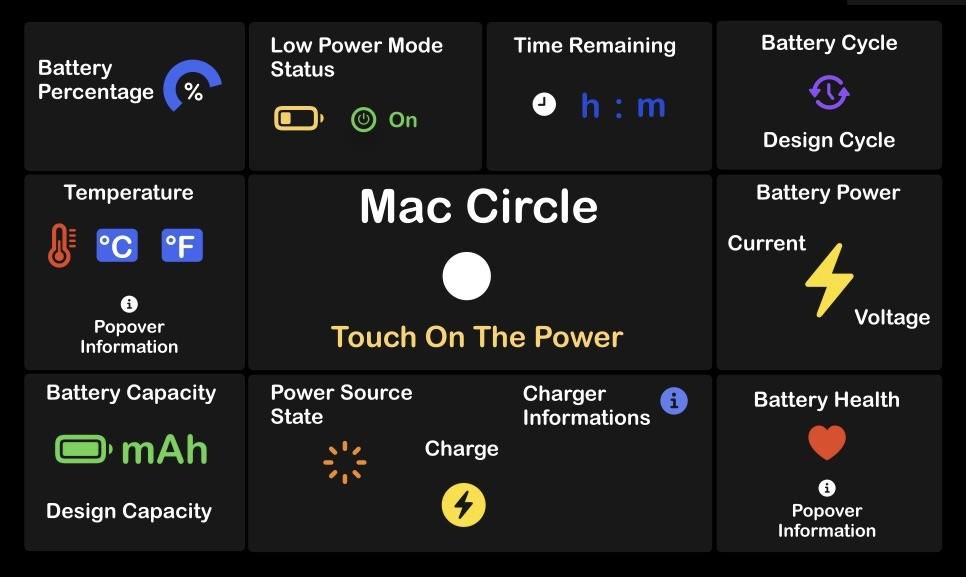
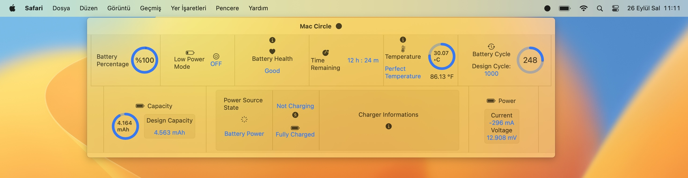
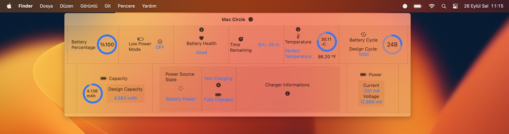

# **Mac Circle**

**Touch on the Power**

Mac Circle is a macOS app developed with SwiftUI.

## Overview

### Menu Bar Extra

### Charge Animation

---

### Light Mode

### Dark Mode

Mac Circle supports dark mode.

---

## Installation

To install Mac Circle, follow these steps:

1. [Download the latest release](https://github.com/brk-ozs11/Mac-Circle/releases/latest) of Mac Circle.
2. Once downloaded, locate the `.app` file in your Downloads folder.
3. Drag the `.app` file into your Applications folder to install it.

That's it! You can now launch Mac Circle from your Applications folder.

## Support

## License

This project is licensed under the MIT License - see the [LICENSE](LICENSE) file for details.

Last Updated: September 13, 2023

